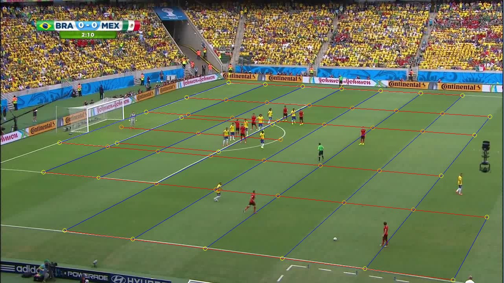
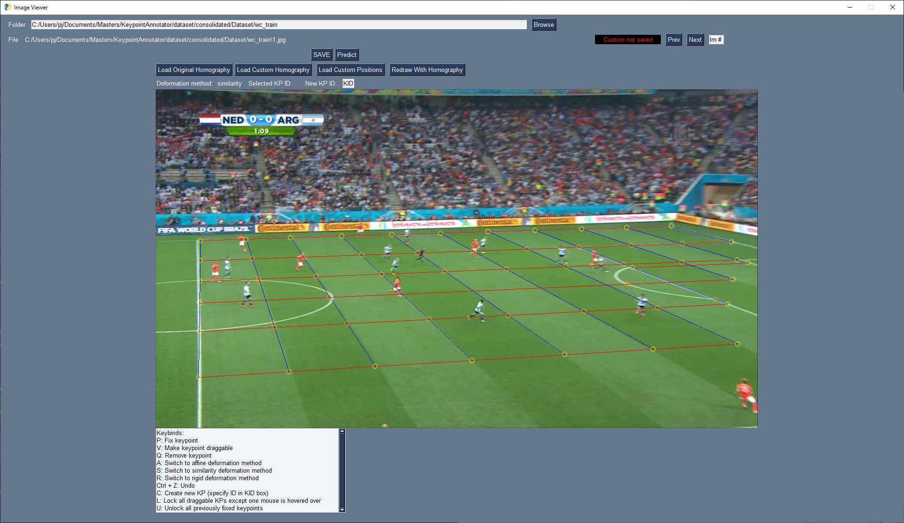
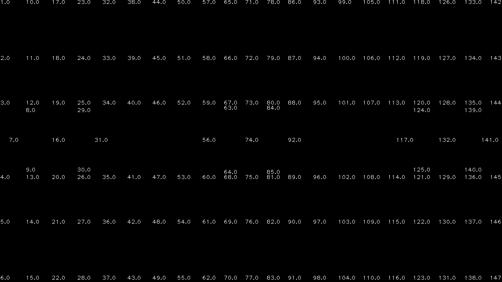

# Keypoint Annotation Software for Homography Labelling of Soccer Images

This repository aims to ease the process of refining existing homography annotations for the *WorldCup* and *TS-WorldCup* datasets. 
For example, this keypoint reprojection from the *WorldCup* dataset


is refined to



This is achieved by forming a grid of keypoints based on the template constructed in *utils.py*, and deforming this grid by dragging
keypoints to the desired location. To allow keypoint updates to affect one another, we implement the deformation methods presented in the 
paper [Image Deformation Using Moving Least Squares](https://people.engr.tamu.edu/schaefer/research/mls.pdf).

Furthermore, this repository consolidates the *WorldCup* and *TS-WorldCup* datasets into the Consolidated WorldCup dataset.

## Getting Started

Create a new conda environment with the packages specified in spec_file.txt:

```
$ conda create --name <env> --file spec_file.txt
```

Then, activate the new environment and run image_viewer.py:

```
$ conda activate <env>
$ python src/image_viewer.py
```

This will open the following window:


Click *Browse* and navigate towards the folder containing the images to be annotated. E.g. *dataset/consolidated/Dataset/wc_train/*.
The images in the folder are loaded and you can start dragging *draggable* keypoints (*these are yellow*) around. 



Note the keybinds at the bottom.
Hovering over a keypoint and pressing *P* will fix a keypoint such that it is seen as a control point by the deformation method in use. You can also
switch between deformation methods and delete or create keypoints. When creating keypoints, specify the keypoint ID in the *New KP ID* field and press enter.
The default KP IDs are illustrated in dataset/consolidated/template_labels.png:



Clicking on a keypoint will also display its ID next to the *Selected KP ID* field.
When moving an existing keypoint, it does not have to be deleted before creating the new one.

It is also possible to change the field template keypoints by altering the *gen_template_grid* function
in *utils.py*.

Once all keybinds are in their desired locations, press *SAVE* and the homography and ground truth keypoint positions will be saved to the *custom_labels* folder,
i.e. *dataset/consolidated/custom_labels*. You can then press *Next* and keep labelling. You can check the annotations that were saved previously (note the field next to *Prev* shows whether
custom labels exist for the current image) with the *Load* buttons.

## Predict function

The *Predict* button estimates a global affine transformation between the current and previous frames. This can be used to predict where 
keypoints should be in the current frame, given that their ground truth positions were last displayed in the previous frame. This speeds up labelling significantly 
for videos!
